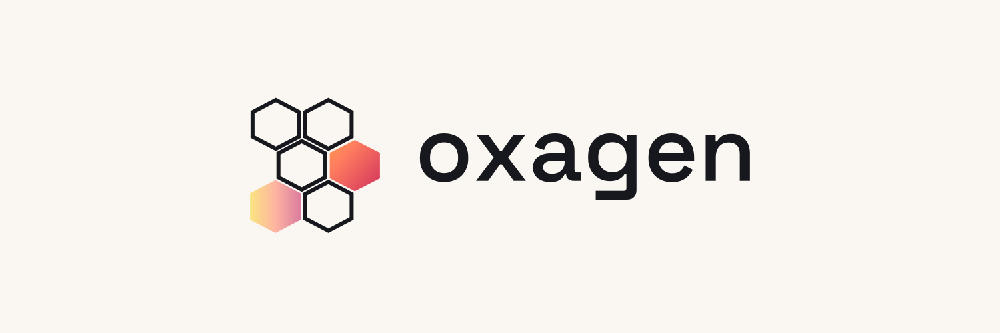

<div align="center">

<picture>
  <source media="(prefers-color-scheme: dark)" srcset="./assets/hero-dark.png">
  <source media="(prefers-color-scheme: light)" srcset="./assets/hero-light.png">
  
</picture>

<h3>The infrastructure layer for AI agents</h3>

<p><strong>You build the agent. Oxagen runs the plumbing.</strong></p>

<p>Cheaper tokens, higher quality, and an audit trail you can actually read.<br>
Governed by contract. Grounded in a graph. Metered straight to the bill.</p>

<p>
  <a href="https://oxagen.sh"></a>
  <a href="https://docs.oxagen.sh"></a>
  <a href="https://x.com/oxagenai"></a>
</p>

</div>

---

## Why teams run on Oxagen

Your AI agents cost too much, drift in quality, and nobody can prove what they did. Oxagen is the neutral control plane that fixes all three.

- **Governed by contract.** Every tool call is a typed contract that binds identity, permitted action, price, and a verified outcome. Tools stay governed and hard to poison.
- **Grounded in a graph.** A knowledge graph and ontology ground answers in cited, time-aware context, so agents are right, not just fast.
- **Metered to the bill.** Observed usage flows straight to billing, so spend stays flat while usage grows.
- **Neutral by default.** Any model, any provider, bring your own keys. We never lock you in.

Same power in the REST API, the MCP server, the web app, and the CLI. One capability, every surface, identical behavior.

---

## Open source

We build in the open. These are the tools we use to keep agents fast, honest, and measurable. Use them, fork them, send patches.

### Stella &nbsp;·&nbsp; a terminal coding agent, in Rust

<p>
  <a href="https://github.com/oxageninc/stella"></a>
  
  <a href="https://github.com/oxageninc/stella/blob/main/LICENSE"></a>
</p>

A fast, BYOK, model-agnostic coding agent for your terminal. Parallel tools, judged goals, and witness-verified "done", with local-first telemetry. Bring your own key and point it at any model.

```bash
brew install oxageninc/stella/stella
```

<a href="https://github.com/oxageninc/stella">Repository</a> &nbsp;·&nbsp; <a href="https://docs.oxagen.sh/stella">Docs</a>

### Arena &nbsp;·&nbsp; benchmark your agent against the best

<p>
  <a href="https://github.com/oxageninc/arena"></a>
  
  <a href="https://github.com/oxageninc/arena/blob/main/LICENSE"></a>
</p>

Wire up a Harbor benchmark adapter and run your coding agent side-by-side with Claude Code, Gemini, and other top agents. Regression checks keep your agent improving instead of drifting or degrading, and the scoring is fair, unbiased, and reproducible.

<a href="https://github.com/oxageninc/arena">Repository</a>

### More in the open

- **[homebrew-stella](https://github.com/oxageninc/homebrew-stella)** &nbsp;·&nbsp; the Homebrew tap for Stella. `brew install oxageninc/stella/stella`.
- **[oxagen.sh](https://github.com/oxageninc/oxagen.sh)** &nbsp;·&nbsp; open business documents and templates.

---

## Sponsor the work

Stella and Arena are built and maintained by **[Mac Anderson](https://github.com/macanderson)**. If they save you time, or you want to see them get better faster, sponsorship funds the work directly. No hype, just more shipped.

<p>
  <a href="https://github.com/sponsors/macanderson"></a>
</p>

---

<div align="center">
<sub>Built by <a href="https://github.com/macanderson">Mac Anderson</a> and the Oxagen team &nbsp;·&nbsp; <a href="https://oxagen.sh">oxagen.sh</a> &nbsp;·&nbsp; <a href="https://x.com/oxagenai">@oxagenai</a></sub>
</div>
